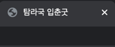

# HTML

## HTML이란?
    HTML (Hyper Text Markup Language)
    - 하이퍼텍스트: 문서를 서로 연결해 주는 링크를 의미
    - 마크업: 표시한다는 의미

- 기능
    + 웹 브라우저에 보여 줄 내용에 마크업하고 문서끼리 링크하는 것
    + 참고: 문서의 배치를 다양하게 바꾸고, 글자를 보기 좋게 꾸미는 것은 스타일시트의 기능
    + 웹문서를 만드는 기본 언어
    + 웹 브라우저에 내용을 보여 주는 텍스트, 이미지, 영상 등의 위치를 표시

<br>
      
- HTML5:
    + 2014년 11월에 발표된 HTML 표준 규약
    + 숫자는 버전을 의미
    + 현재 HTML은 HTML5를 의미함
    
---

## HTML 구조

웹 문서는 보통 <!DOCTYPE html>로 시작해서 <html>, <head>, <body> 3개의 영역으로 구성됨

- ```<!DOCTYPE html>```: 현재 문서가 HTML5 언어로 작성학 웹 문서라는 의미
- ```<html> ~ </html>```: 웹 문서의 시작과 끝을 의미
- ```<head> ~ </head>```: 웹 문서의 정보를 저장
- ```<body> ~ </body>```: 웹 브라우저에 보여줄 내용을 저장

메타 정보 <meta>: 데이터에 관한 데이터를 의미
- 웹 문서와 관련된 정보를 지정할 때 사용
- 웹 사이트의 키워드, 간단한 설명 제작자 정보 등을 지정 가능
-  ex. 인코딩 정보 --> ```<meta charset="UTF-8">```


---

## HTML 태그
- title
    + 웹문서의 제목을 나타냄
    + ``` <title>탐라국 입춘굿</title>```
    
    

