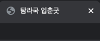
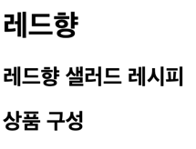
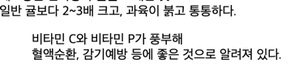
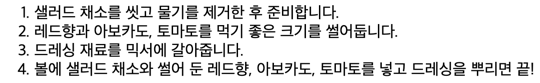
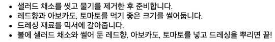

# HTML 태그

## title
- 웹 문서의 제목을 나타냄
- ``` <title>탐라국 입춘굿</title>```<br>

  
## hn (h1 ~ h6)
- 제목(heading)을 나타내는 태그
- 다른 텍스트보다 크고 진하게 표시함
- n의 자리에는 1~6의 숫자가 들어가며 제목 텍스트를 크기별로 표시 가능
```html
<h1>레드향</h1>
<h2>레드향 샐러드 레시피</h2>
<h2>상품 구성</h2>
```


## p
- 텍스트 단락 입력
```html
<p>레드향은 맛있다!</p>
```

## br
- 줄바꿈
- <br> 태그를 두 번 사용하면 빈 줄이 생기면서 텍스트 단락이 나뉜 것처럼 화면에 표시 가능

## blockquote
- 인용할 때 사용하는 태그
- 웹에서는 다른 텍스트보다 들여써서 표시됨



## strong
- 텍스트를 굵게 표시
- 화면 낭독기는 strong 태그를 사용한 부분을 강조하여 읽어줌

## b
- 텍스트를 굵게 표시

## em
- 이탤릭체로 강조
- 문장에서 특별히 강조하고 싶은 부분에 사용

## i
- 이탤릭체
- 단순히 기울이고 싶을 때 사용

## sub
- 아래 첨자를 표시
```html
H<sub>2</sub>
```

## sup
- 위 첨자를 표시

## u
- 밑줄 표시

## s
- 취소선을 표

## ol
- 순서가 있는 목록 생성
- 속성
    + type : 순서를 나타냄
        + ex.1(숫자), a(영문 소문자), A(영문 대문자), i, I
    + start: 원하는 시작 번호 
```html
<ol>
    <li>샐러드 채소를 씻고 물기를 제거한 후 준비합니다.</li>
    <li>레드향과 아보카도, 토마토를 먹기 좋은 크기를 썰어둡니다.</li>
    <li>드레싱 재료를 믹서에 갈아줍니다.</li>
    <li>볼에 샐러드 채소와 썰어 둔 레드향, 아보카도, 토마토를 넣고 드레싱을 뿌리면 끝!</li>
</ol>
```


## ul 
- 순서가 없는 목록 생성
```html
<ul>
    <li>샐러드 채소를 씻고 물기를 제거한 후 준비합니다.</li>
    <li>레드향과 아보카도, 토마토를 먹기 좋은 크기를 썰어둡니다.</li>
    <li>드레싱 재료를 믹서에 갈아줍니다.</li>
    <li>볼에 샐러드 채소와 썰어 둔 레드향, 아보카도, 토마토를 넣고 드레싱을 뿌리면 끝!</li>
</ul>
```


## dl
- 설명 목록 (description list)
- 이름과 값 형태로 된 목록을 의미함
- 이름 부분을 지정하는 ```<dt>``` 태그와 값 부분을 지정하는 ```<dd>``` 태그로 구성됨

## table
