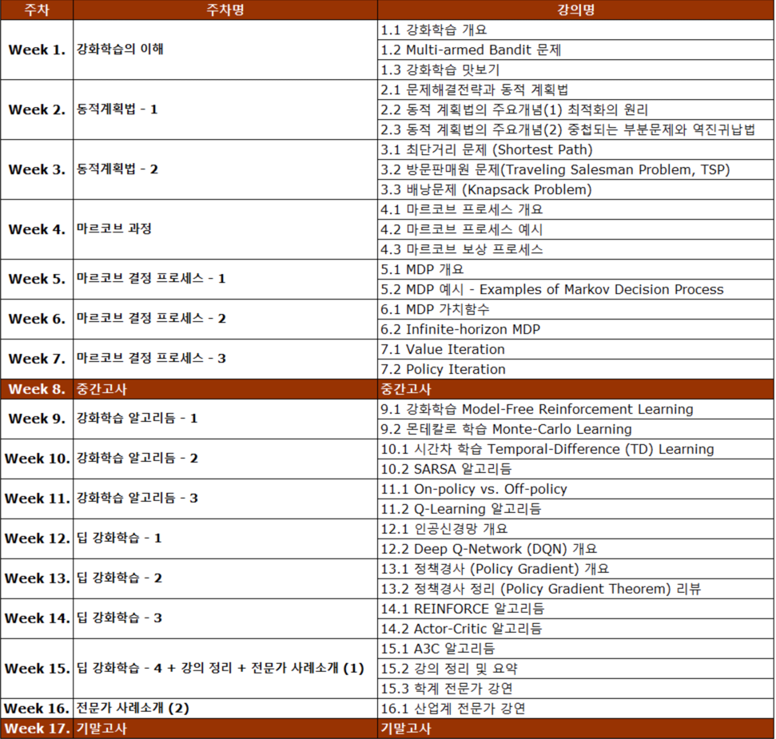

# 강화학습의 수학적 기초와 알고리듬 이해
고려대학교 산업공학과 정태수 교수님 강의 

## 강좌 계획표 (Syllabus)

## 참고 자료
- [Lecture](http://www.kmooc.kr/courses/course-v1:KoreaUnivK+ku_ai_002+2021_A48/course/)

## 강의 정리
- [Week1](https://velog.io/@gjtang/understanding-alg-math-rl-week1)
- [Week2](https://velog.io/@gjtang/understanding-alg-math-rl-week2)
- [Week3](https://velog.io/@gjtang/understanding-alg-math-rl-week3)
- [Week4](https://velog.io/@gjtang/understanding-alg-math-rl-week4)
- [Week5](https://velog.io/@gjtang/understanding-alg-math-rl-week5)
- [Week6]
- [Week7]
- [Week9]
- [Week10]
- [Week11]
- [Week12]
- [Week13]
- [Week14]
- [Week15]
- [Week16]