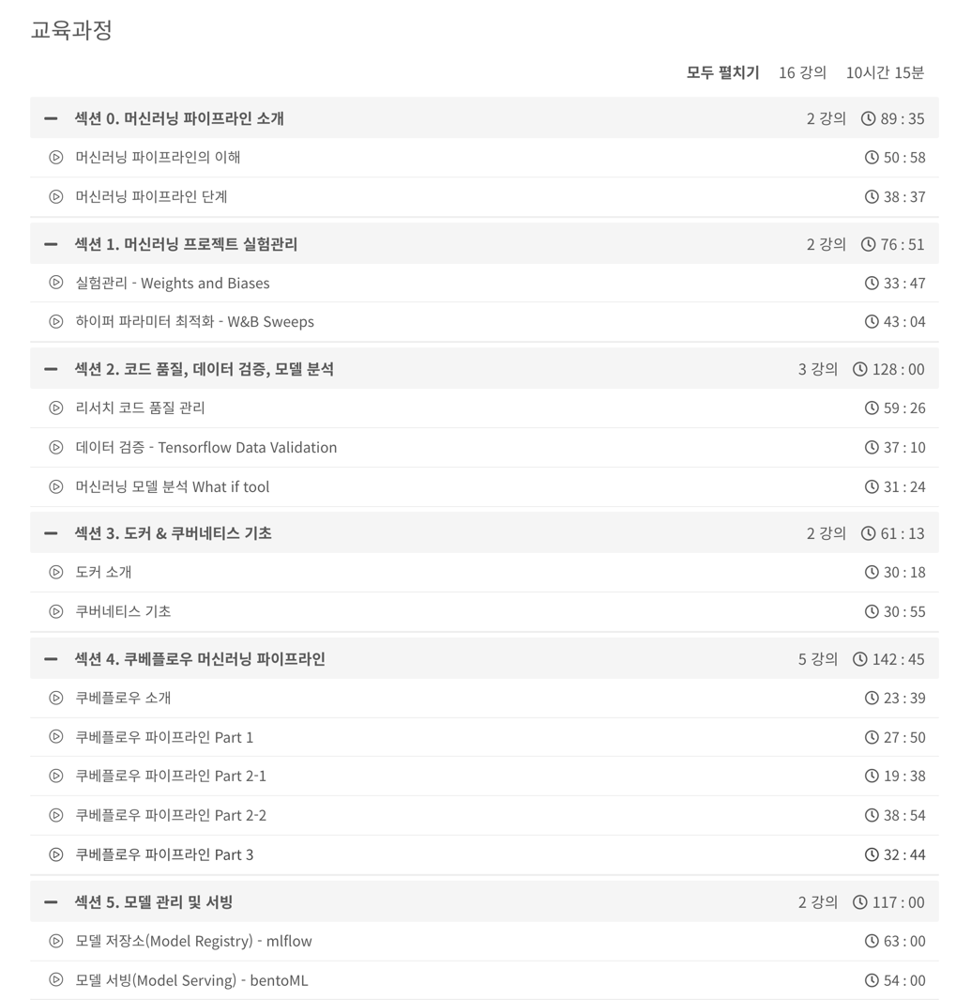

# 머신러닝 엔지니어 실무
인프런 Chris Song님 강의 

## 강좌 계획표 (Syllabus)

## 강의 정리
- [Section0](https://velog.io/@gjtang/%EB%A8%B8%EC%8B%A0%EB%9F%AC%EB%8B%9D-%EC%97%94%EC%A7%80%EB%8B%88%EC%96%B4-%EC%8B%A4%EB%AC%B4-Section0)
- [Section1](https://velog.io/@gjtang/%EB%A8%B8%EC%8B%A0%EB%9F%AC%EB%8B%9D-%EC%97%94%EC%A7%80%EB%8B%88%EC%96%B4-%EC%8B%A4%EB%AC%B4-Section1)
- Section2
  - [Section 2-1](https://velog.io/@gjtang/%EB%A8%B8%EC%8B%A0%EB%9F%AC%EB%8B%9D-%EC%97%94%EC%A7%80%EB%8B%88%EC%96%B4-%EC%8B%A4%EB%AC%B4-Section2-1)
  - Section 2-2, 3    
- [Section3]
- [Section5]