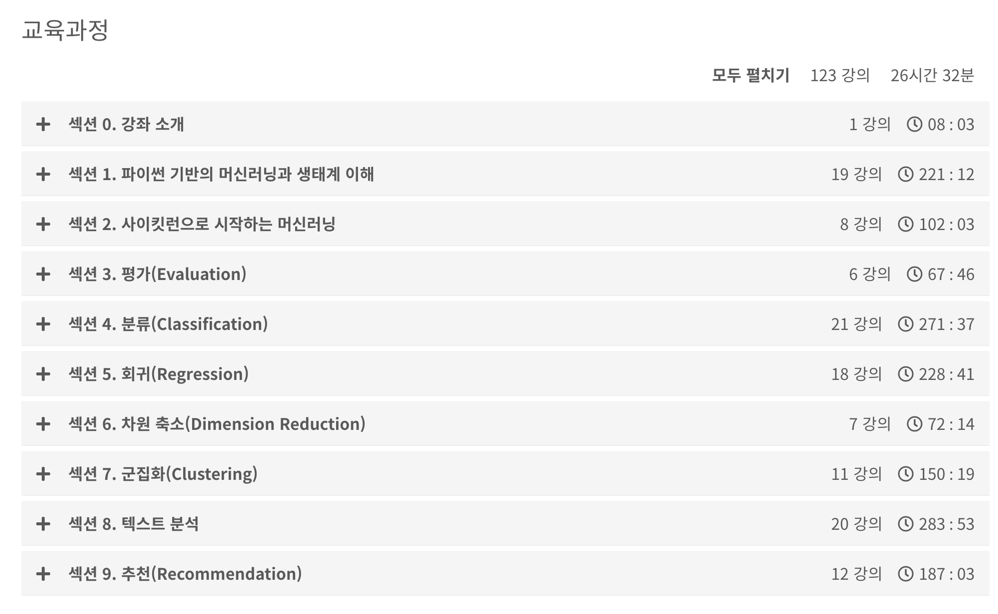

# 파이썬 머신러닝 완벽 가이드
인프런 권철민님 강의 

## 강좌 계획표 (Syllabus)

## 강의 정리
- [Section1](https://velog.io/@gjtang/%ED%8C%8C%EC%9D%B4%EC%8D%AC-%EB%A8%B8%EC%8B%A0%EB%9F%AC%EB%8B%9D-%EC%99%84%EB%B2%BD-%EA%B0%80%EC%9D%B4%EB%93%9C-Section1)
- [Section2](https://velog.io/@gjtang/%ED%8C%8C%EC%9D%B4%EC%8D%AC-%EB%A8%B8%EC%8B%A0%EB%9F%AC%EB%8B%9D-%EC%99%84%EB%B2%BD-%EA%B0%80%EC%9D%B4%EB%93%9C-Section2)
- [Section3](https://velog.io/@gjtang/%ED%8C%8C%EC%9D%B4%EC%8D%AC-%EB%A8%B8%EC%8B%A0%EB%9F%AC%EB%8B%9D-%EC%99%84%EB%B2%BD-%EA%B0%80%EC%9D%B4%EB%93%9C-Section3)
- [Section4](https://velog.io/@gjtang/%ED%8C%8C%EC%9D%B4%EC%8D%AC-%EB%A8%B8%EC%8B%A0%EB%9F%AC%EB%8B%9D-%EC%99%84%EB%B2%BD-%EA%B0%80%EC%9D%B4%EB%93%9C-Section4)
- [Section5](https://velog.io/@gjtang/%ED%8C%8C%EC%9D%B4%EC%8D%AC-%EB%A8%B8%EC%8B%A0%EB%9F%AC%EB%8B%9D-%EC%99%84%EB%B2%BD-%EA%B0%80%EC%9D%B4%EB%93%9C-Section5)
- [Section6]
- [Section7]
- [Section8]
- [Section9]

## Reference
- Author: 권철민
- Publisher: 위키북스
- Code git: https://github.com/wikibook/pymldg-rev