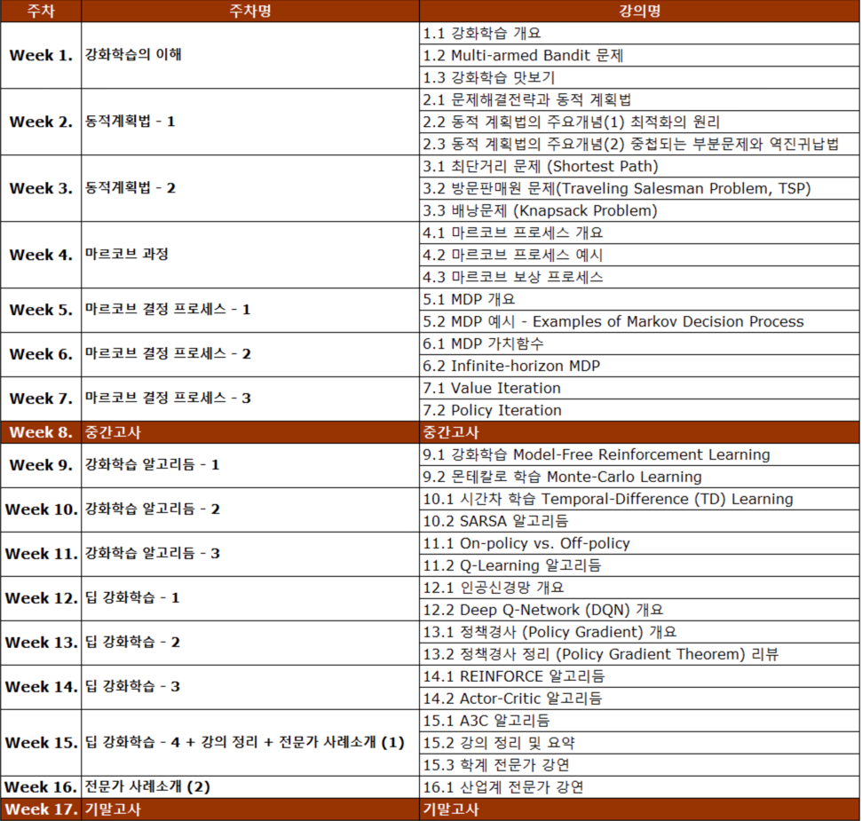

# 강화학습의 수학적 기초와 알고리듬 이해
고려대학교 산업공학과 정태수 교수님 강의 

## 강좌 계획표 (Syllabus)

## 참고 자료
- [Lecture](http://www.kmooc.kr/courses/course-v1:KoreaUnivK+ku_ai_002+2021_A48/course/)

## 강의 정리
- [Week1](https://velog.io/@gjtang/understanding-alg-math-rl-week1)
- [Week2](https://velog.io/@gjtang/understanding-alg-math-rl-week2)
- [Week3](https://velog.io/@gjtang/understanding-alg-math-rl-week3)
- [Week4](https://velog.io/@gjtang/understanding-alg-math-rl-week4)
- [Week5](https://velog.io/@gjtang/understanding-alg-math-rl-week5)
- [Week6](https://velog.io/@gjtang/understanding-alg-math-rl-week6)
- [Week7](https://velog.io/@gjtang/%EA%B0%95%ED%99%94%ED%95%99%EC%8A%B5%EC%9D%98-%EC%88%98%ED%95%99%EC%A0%81-%EA%B8%B0%EC%B4%88%EC%99%80-%EC%95%8C%EA%B3%A0%EB%A6%AC%EB%93%AC-%EC%9D%B4%ED%95%B4-Week7#7-1-value-iteration)
- [Week9](https://velog.io/@gjtang/%EA%B0%95%ED%99%94%ED%95%99%EC%8A%B5%EC%9D%98-%EC%88%98%ED%95%99%EC%A0%81-%EA%B8%B0%EC%B4%88%EC%99%80-%EC%95%8C%EA%B3%A0%EB%A6%AC%EB%93%AC-%EC%9D%B4%ED%95%B4-Week9)
- [Week10] 
- [Week11]
- [Week12]
- [Week13] 
- [Week14]
- [Week15]
- [Week16] 